# Домашнє завдання до Теми 4. DML та DDL команди. Складні SQL вирази

## 1. Створіть базу даних для керування бібліотекою книг згідно зі структурою, наведеною нижче.

[Query](./assets/p1_query.sql)

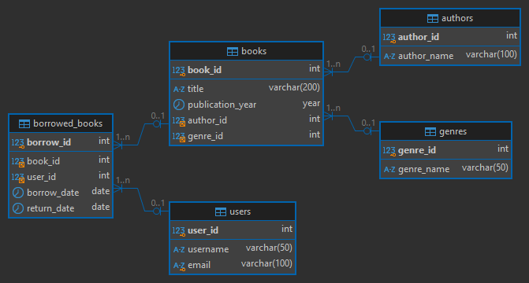

## 2. Заповніть таблиці простими видуманими тестовими даними.

[Query](./assets/p2_query.sql)

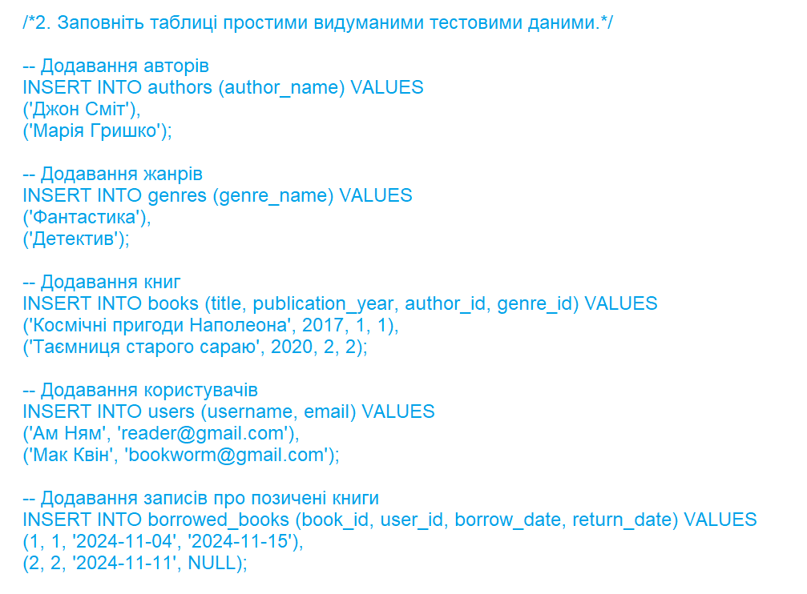
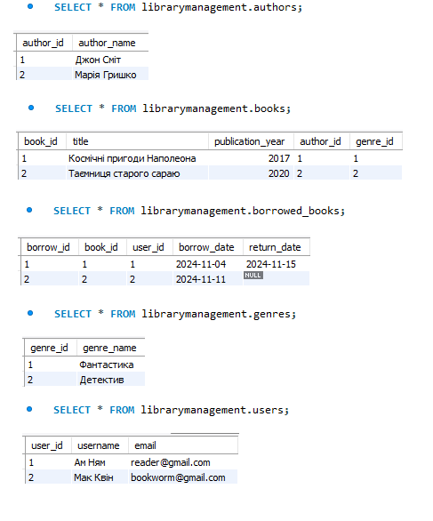

## 3. Перейдіть до бази даних, з якою працювали у темі 3. Напишіть запит за допомогою операторів FROM та INNER JOIN, що об’єднує всі таблиці даних, які ми завантажили з файлів: order_details, orders, customers, products, categories, employees, shippers, suppliers.

[Query](./assets/p3_query.sql)

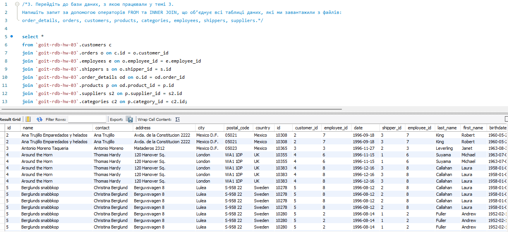

## 4. Виконайте запити, перелічені нижче.

[Query](./assets/p4_query.sql)

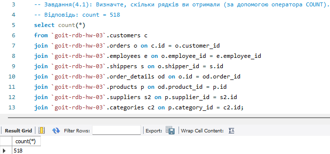
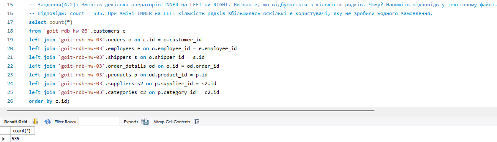
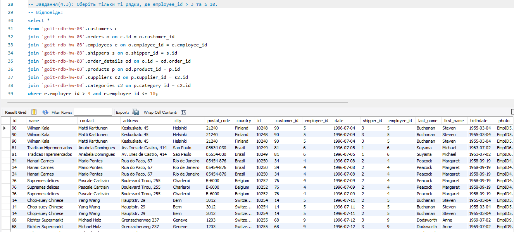
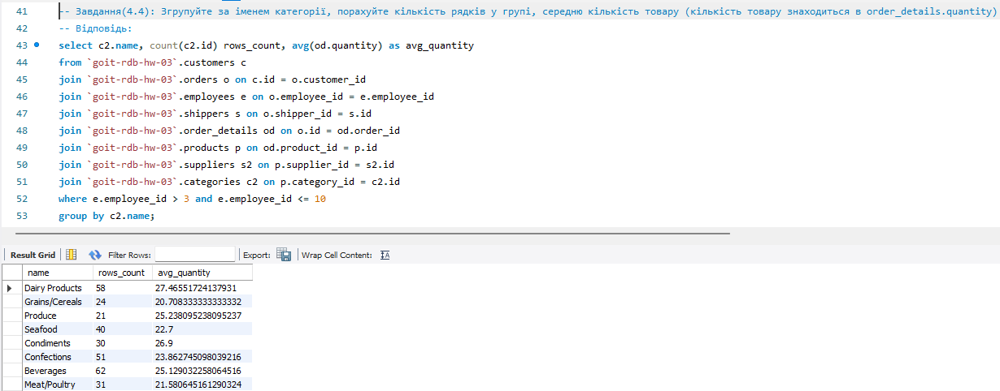
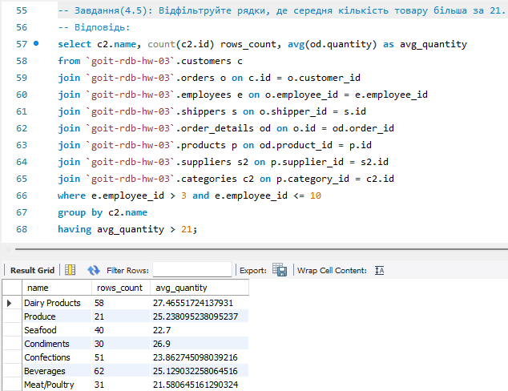
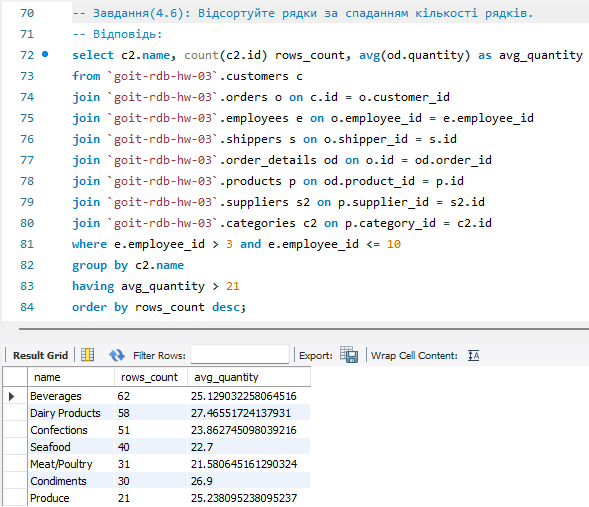
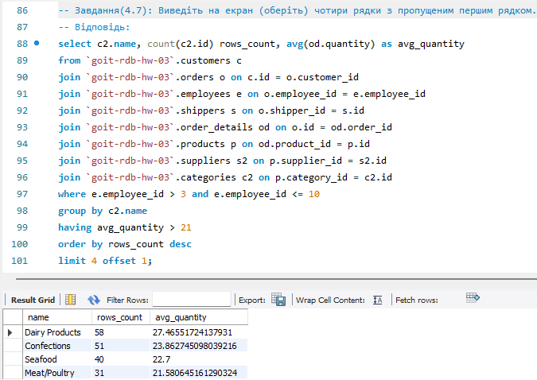
